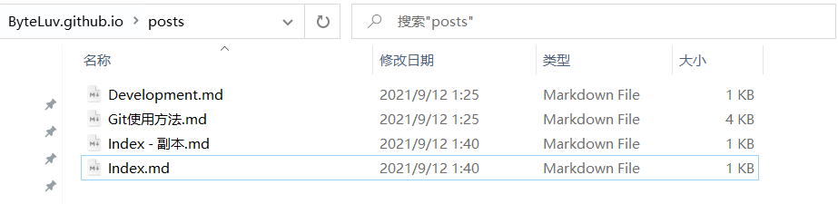
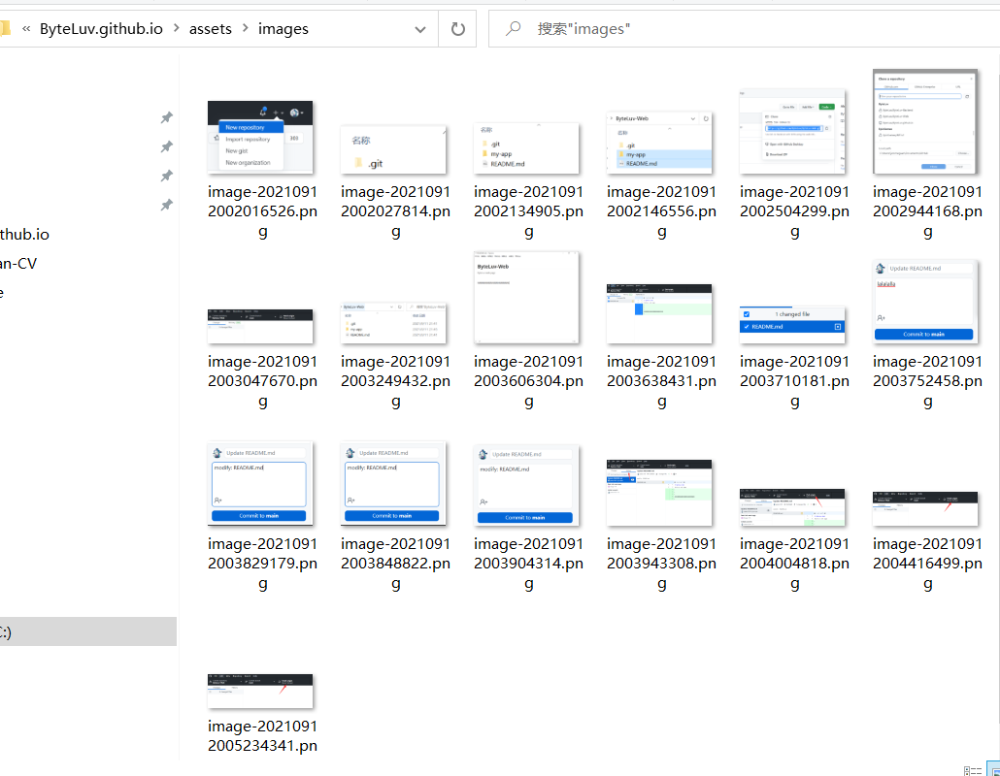

## 在ByteLuv.github.io中添加文档

- 仓库目录：[ByteLuv/ByteLuv.github.io: ByteLuv Homepage](https://github.com/ByteLuv/ByteLuv.github.io)
- 添加文档：在post目录中新建.md



- 参考其他.md，向开头加入头部内容

```
---
layout: page
title: 文档名
permalink: /testDocument/
categories: Development
---
```

*testDocument替换成任意英文名*

- 父子标题：
  - 父级添加   ```has_children: true```
  - 子级添加   ```parent: 父级文档名```

- 后面加入内容即可

- 添加图片

  - 将图片放入该目录

    

  - 在markdown中修改图片目录为相对路径

    ``` ../assets/images/******.png```

## 本地预览文档页面

- 安装Ruby : [Download Ruby (ruby-lang.org)](https://www.ruby-lang.org/en/downloads/)

- 安装RubyGems : [Download RubyGems | RubyGems.org | Ruby 社区 Gem 托管](https://rubygems.org/pages/download)

- 命令行进入github.io目录

- 执行命令安装bundler

  ``` gem install jekyll bundler```

- 初始化bundle

  ``` bundle install```

- 最后执行

  ```bundle exec jekyll serve```

- 显示成功后进入本地地址

  ```http://localhost:4000```

## 将文档上传github.io

直接将修改的md push到仓库即可
