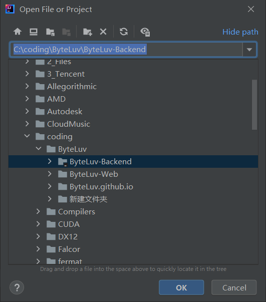
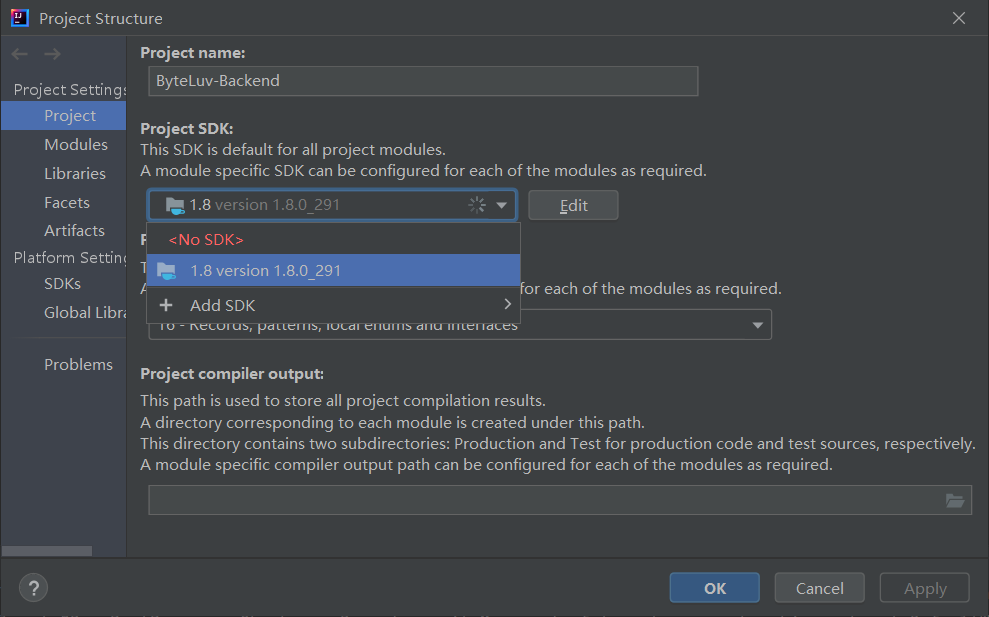
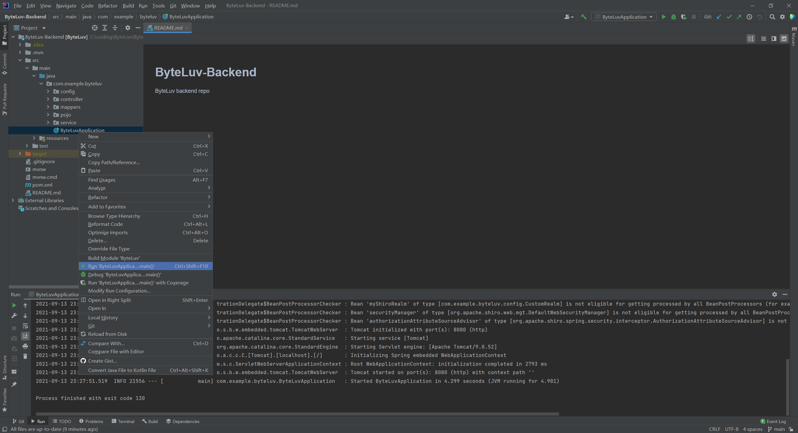
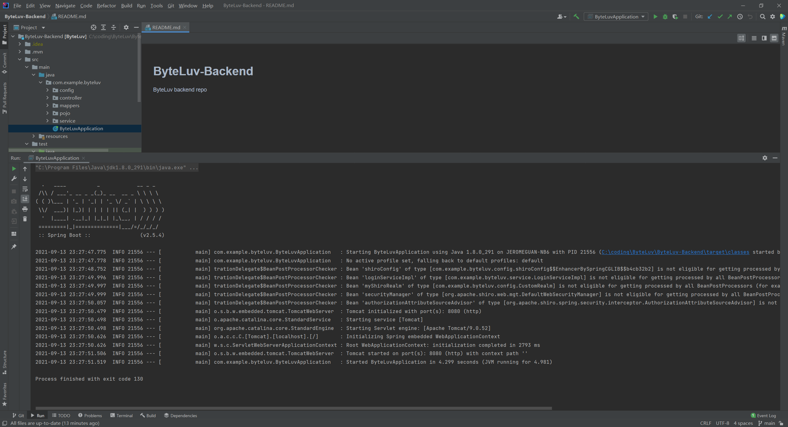

## 后端开发环境配置

- **仓库目录：**[ByteLuv/ByteLuv-Backend: ByteLuv backend repo (github.com)](https://github.com/ByteLuv/ByteLuv-Backend)

- **开发环境**

  - Windows 10
  - IntelliJ IDEA 2021.1.1
  - MySQL
  - Java (jdk 1.8)

- **开发环境配置**

  - 下载安装IDEA ：[Download IntelliJ IDEA: The Capable & Ergonomic Java IDE by JetBrains](https://www.jetbrains.com/idea/download/#section=windows)

  - 打开项目

    

  - File -> Project Structure 修改SDK版本为1.8

    

  - 进入src目录，运行对应的java项目

    

  - 开始运行

  

- **开发框架**

  - SpringBoot
  - Shiro

  
